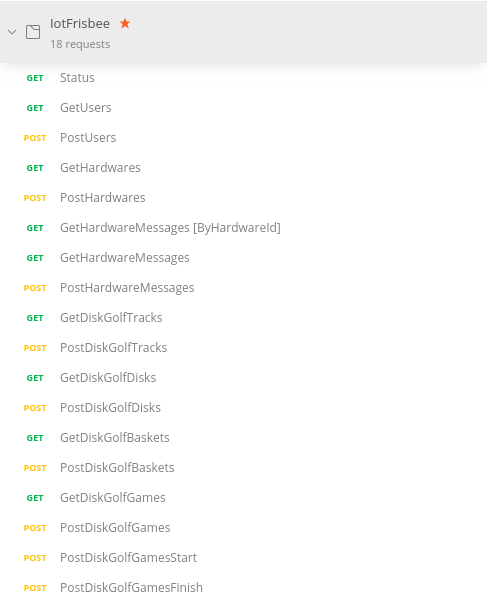
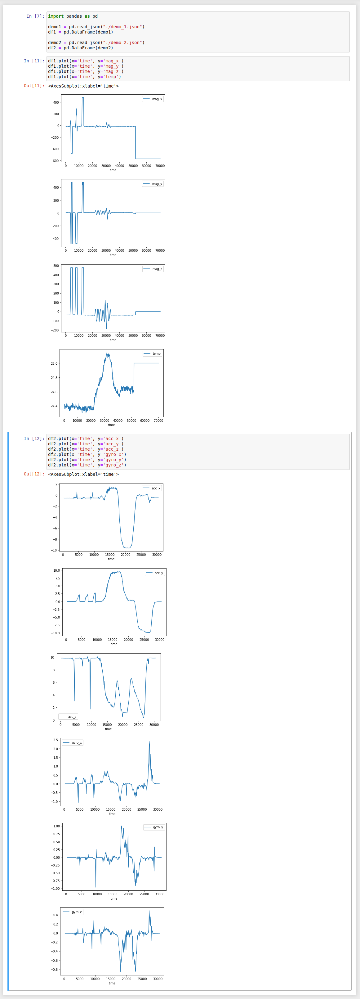

# Demo izpētes nolūkiem

## Centrālais serveris
Ieslēdzam centralizēto serveri
```bash
$ git rev-parse --show-prefix
backend/
$ sbt web/run
[info] welcome to sbt 1.5.0 (AdoptOpenJDK Java 11.0.11)
[info] loading global plugins from /home/kshaa/.sbt/1.0/plugins
[info] loading settings for project backend-build from plugins.sbt ...
[info] loading project definition from /home/kshaa/Code/iot-frisbee/backend/project
[info] loading settings for project root from build.sbt ...
[info] set current project to root (in build file:/home/kshaa/Code/iot-frisbee/backend/)

--- (Running the application, auto-reloading is enabled) ---

[info] p.c.s.AkkaHttpServer - Listening for HTTP on /0:0:0:0:0:0:0:0:9000

(Server started, use Enter to stop and go back to the console...)
```

Testējam pāris interesantus pieprasījumus
```bash
$ # Izveidojam lietotāju centralizētajā serverī
$ curl --location --request POST 'http://localhost:9000/api/v1/users/' \
    --header 'Content-Type: application/json' \
    --data-raw '{ "username": "krisjanisv" }'
{
  "success" : {
    "id" : "57c69997-e19b-4e11-9901-946ed72b1026",
    "username" : "krisjanisv"
  }
}
$ # Reģistrējam aparatūru centralizētajā serverī
$ curl --location --request POST 'http://localhost:9000/api/v1/hardwares/' \
    --header 'Content-Type: application/json' \
    --data-raw '{ "name": "raspberry-pi-4b-nr-1", "ownerId": "57c69997-e19b-4e11-9901-946ed72b1026" }'
{
  "success" : {
    "id" : "b0909d2b-e8c7-44c2-bf94-4d60c24fb18c",
    "name" : "raspberry-pi-4b-nr-1",
    "batteryPercent" : 0.0,
    "ownerId" : "57c69997-e19b-4e11-9901-946ed72b1026"
  }
}
$ # Pārbaudam, ka protam bash uzrakstīt divas komandas tā, ka viena izpildīsies fonā pēc 5 sekundēm
$ sleep 5s && echo "second" & echo "first"
[1] 282791
first
[... paiet 5 sekundes]
[1]+  Done                    echo "first"
second
$ # Abonamējamies pie aparatūras iesūtītajām ziņām un pēc 5 sekundēm iesūtam aparatūras ziņu
$ sleep 5s && \
    curl -s --location --request POST 'http://localhost:9000/api/v1/hardware-messages/' \
    --header 'Content-Type: application/json' \
    --data-raw '{ "hardwareId": "b0909d2b-e8c7-44c2-bf94-4d60c24fb18c", "messageType": "test-debug-websocket", "message": "foobar" }' > /dev/null & \
    ws ws://localhost:9000/api/v1/hardwares/b0909d2b-e8c7-44c2-bf94-4d60c24fb18c/messages/subscribe
[1] 283588
[... Akka Play serveris inicializē abonamentu]
< subscribed
[... pēc 5 sekundēm tiek iesūtīta ziņa un mēs saņemam notifikāciju]
< {
  "id" : "97cab652-c647-446c-acd6-0318be994a77",
  "hardwareId" : "b0909d2b-e8c7-44c2-bf94-4d60c24fb18c",
  "messageType" : "test-debug-websocket",
  "message" : "foobar"
}
>  
```

  


## Mikrokontroliera serial, BLE komunikācija
```bash
$ sudo su # Jo bez root NodeJS bibliotēka nespēj piekļūt Bluetooth adapterim
$# git rev-parse --show-prefix
basket/
$# npx ts-node main.ts
Running IoT Basket
powered on, starting scanning
Started scanning
Device 'IoT Frisbee', RSSI: -55 (Very good), in basket = false
Stopped scanning
Device 'IoT Frisbee', RSSI: -54 (Very good), in basket = false
Device 'IoT Frisbee', RSSI: -55 (Very good), in basket = false
Device 'IoT Frisbee', RSSI: -54 (Very good), in basket = false
Device 'IoT Frisbee', RSSI: -54 (Very good), in basket = false
Device 'IoT Frisbee', RSSI: -49 (Excellent), in basket = true
Frisbee seems to have fallen in the basket, inspecting...
Frisbee UART connection found, extracting data
[...]
$ echo "bluetooth mic check" > /dev/ttyUSB0
[...]
Data:  bluetooth mic check
```

## Sensora datu apstrāde
```bash
$ git rev-parse --show-prefix
frisbee/
$ pio run --target=upload
Processing adafruit_feather_nrf52832 (platform: nordicnrf52; board: adafruit_feather_nrf52832; framework: arduino)
[...]
RAM:   [=         ]  14.3% (used 9340 bytes from 65536 bytes)
Flash: [==        ]  15.9% (used 83512 bytes from 524288 bytes)
Building .pio/build/adafruit_feather_nrf52832/firmware.zip
[...]
Auto-detected: /dev/ttyUSB0
Uploading .pio/build/adafruit_feather_nrf52832/firmware.zip
Upgrading target on /dev/ttyUSB0 with DFU package /home/kshaa/Code/iot-frisbee/frisbee/.pio/build/adafruit_feather_nrf52832/firmware.zip. Flow control is disabled, Single bank, Touch disabled
########################################
########################################
########################################
########################################
####
Activating new firmware
Device programmed.
$ mkdir experiments
$ # 3 reizes pielikts magnēts
$ # 1 reizes pielikts klāt silts lodāmurs
$ pio device monitor -b 115200 | tee experiments/demo_1
--- Available filters and text transformations: colorize, debug, default, direct, hexlify, log2file, nocontrol, printable, send_on_enter, time
--- More details at http://bit.ly/pio-monitor-filters
Initializing iot-frisbee with Adafruit nRF52832, LSM6DS, LIS3MDL!
Starting LSM6DS chip I2C connection
Started LSM6DS chip I2C connection
Starting LIS3MDL chip I2C connection
Started LIS3MDL chip I2C connection
Setting LSM6DS accelerometer range to: +-4G
Setting LSM6DS accelerometer data rate to: 12.5 Hz
Setting LSM6DS gyro range to: 250 degrees/s
Setting LSM6DS gyro data rate to: 12.5 Hz
Setting LSM6DS magnetometer range to: +-4 gauss
Setting LSM6DS magnetometer data rate to: 155 Hz
Setting LSM6DS magnetometer performance mode to: Medium
Setting LSM6DS magnetometer operation mode to: Continuous
Starting Bluefruit chip
Started Bluefruit chip
Starting Bluetooth device information service
Started Bluetooth device information service
Starting Bluetooth UART service
Started Bluetooth UART service
Starting Bluetooth battery level service
Started Bluetooth battery level service
Starting Bluetooth advertisement service
Started Bluetooth advertisement service
{ "time": 348, "acc_x": -0.5204, "acc_y": -0.1137, "acc_z": 9.8596, "gyro_x": -0.0006, "gyro_y": -0.0199, "gyro_z": -0.0147, "mag_x": -16.1649, "mag_y": 5.5101, "mag_z": -35.9690, "temp": 24.42 } 
{ "time": 470, "acc_x": -0.5109, "acc_y": -0.1149, "acc_z": 9.8584, "gyro_x": -0.0002, "gyro_y": -0.0205, "gyro_z": -0.0148, "mag_x": -15.8287, "mag_y": 5.3493, "mag_z": -37.0213, "temp": 24.41 } 
{ "time": 591, "acc_x": -0.4917, "acc_y": -0.1017, "acc_z": 9.8596, "gyro_x": -0.0014, "gyro_y": -0.0188, "gyro_z": -0.0151, "mag_x": -15.5218, "mag_y": 5.0570, "mag_z": -37.2406, "temp": 24.36 } 
[...]
$ cp experiments/demo_1  experiments/demo_1.json && vim experiments/demo_1.json
$ # Manuāla seriālo datu apstrāde, lai izveidotu korekti strukturizētu JSON failu
$ # 3 metieni
$ # 3 rotēts sensors
$ pio device monitor -b 115200 | tee experiments/demo_2
[...]
$ cp experiments/demo_2  experiments/demo_2.json && vim experiments/demo_2.json
$ # Manuāla seriālo datu apstrāde, lai izveidotu korekti strukturizētu JSON failu
$ jupyter-notebook
[I 02:41:23.172 NotebookApp] Serving notebooks from local directory: /home/kshaa/Code/iot-frisbee/frisbee/experiments
[I 02:41:23.172 NotebookApp] Jupyter Notebook 6.2.0 is running at:
[...]
$ # Jupyter notebook izpētes skripta sarakstīšana
[...]
```

  
