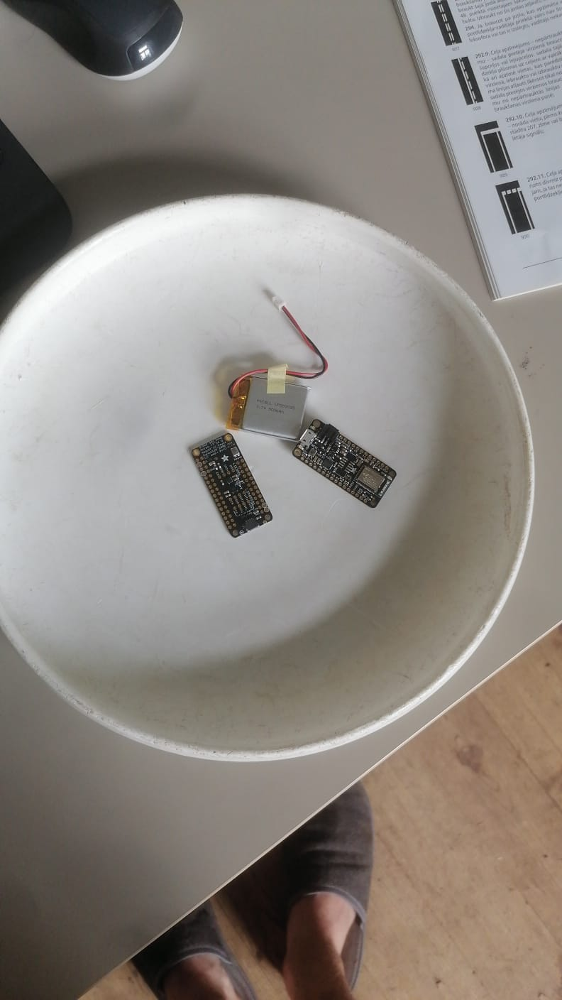
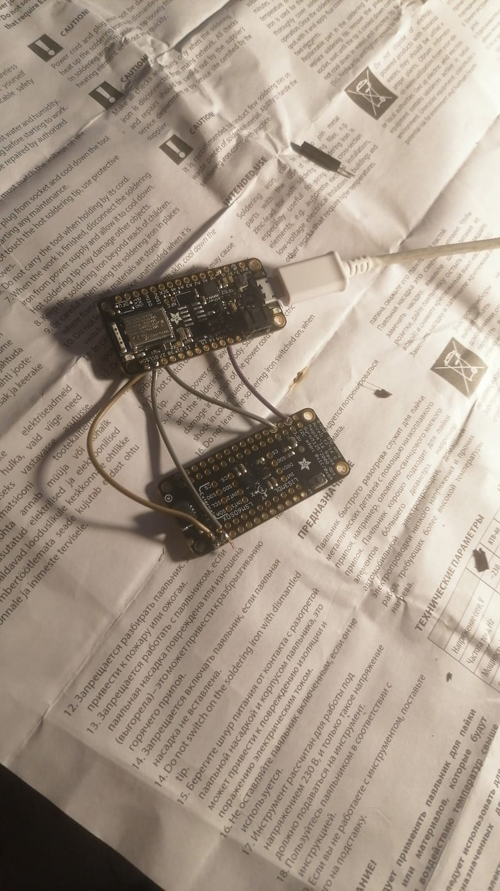
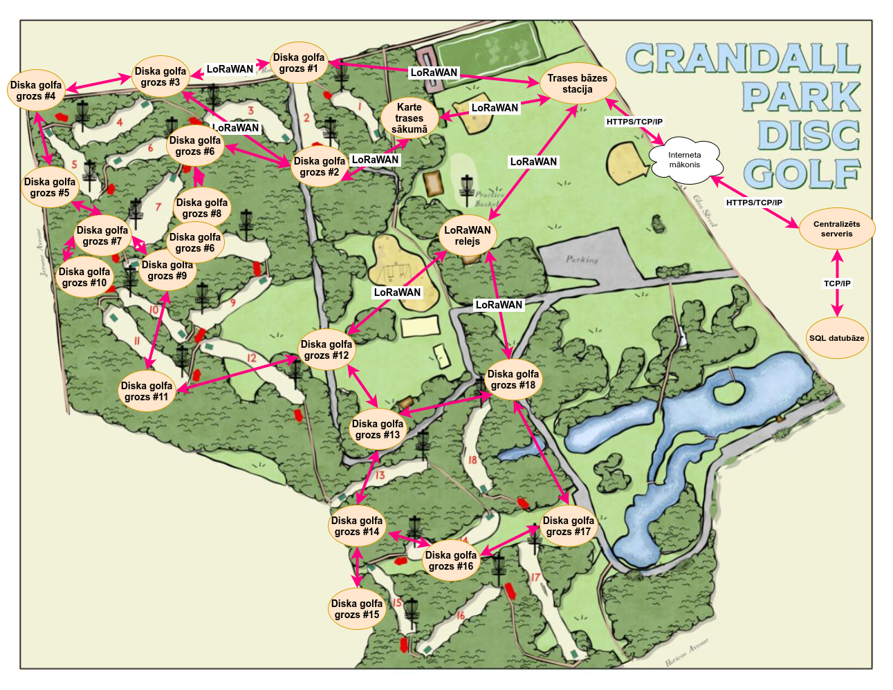
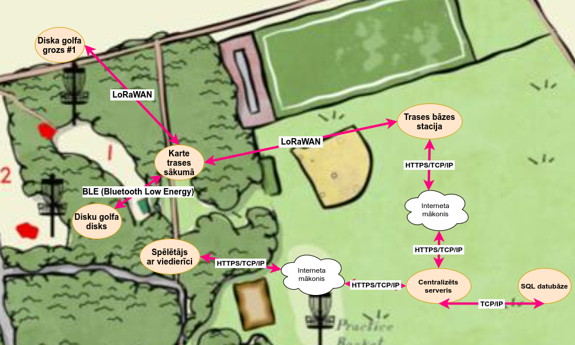
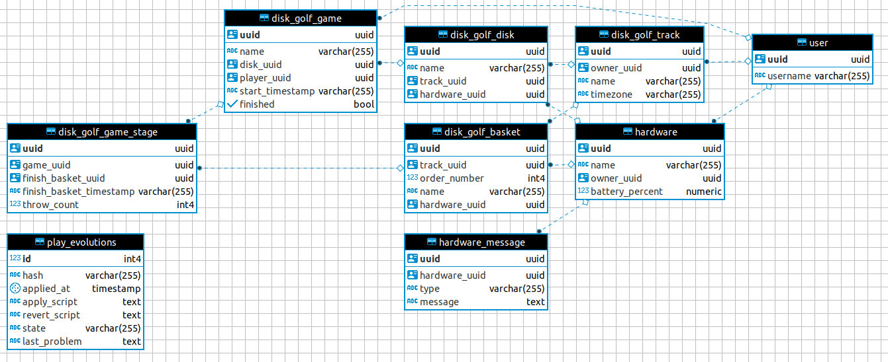
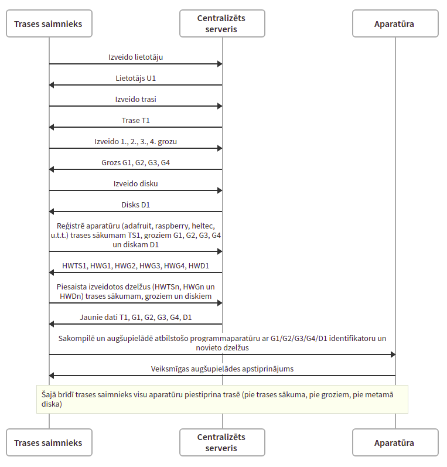
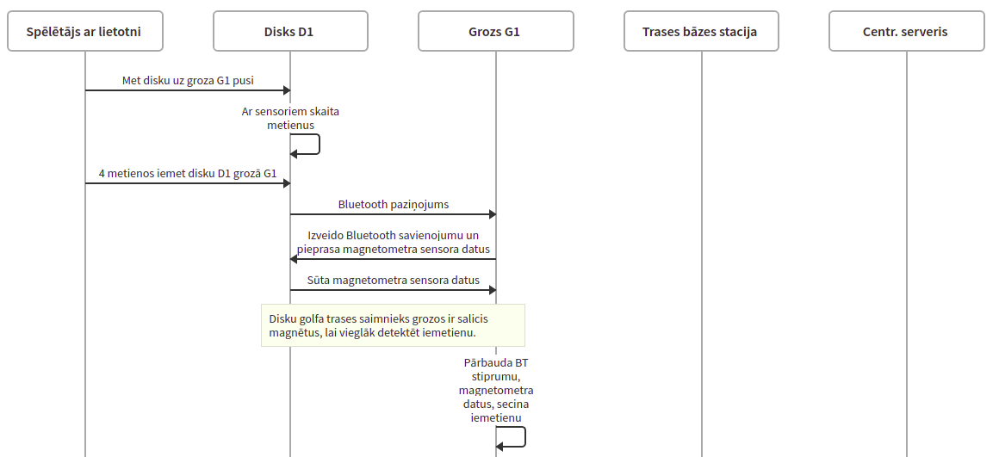
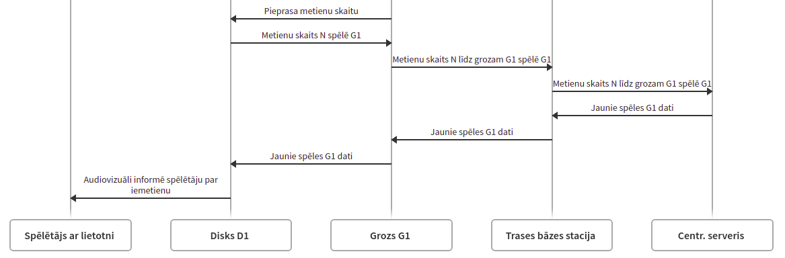

# IoT disku golfs

## Disku golfa grozs

## Disku golfa disks

## Trase

## Trases sākums

## Relāciju shēma

## Trases izveidošana

## Trases izspēlēšana

## Aparatūra, inventārs
Kas ir fiziski nepieciešams, lai izstrādātu šādu projektu

### Inventārs
- Disku golfa trase
- Disku golfa trases posmu sākuma kartes
- Disku golfa trases posmu grozi
- Disku golfa trases kase jeb bāze ar interneta pieslēgumu
- Disku golfa diski

### Aparatūra

Diska mikrokontrolieris: [Adafruit nRF52](https://www.adafruit.com/product/3406)
- Arduino ietvara atbalsts
- Bluetooth Low Energy atbalsts
- Izejošs 3.3V izvads ārēju ierīču barošanai (sensoram)
- Ieejošs 4.5V - 5.2V LiPo akumulatora ievads mikrokontroliera barošanai
- USB ligzda izstrādei un barošanai
- I2C protokola atbalsts (piem. sensora komunikācijai)
- SPI protokola atbalsts (piem. raidītāja komunikācijai)
- Analogās ievadligzdas (neizmantotas)
- PWM izvadligzdas (neizmantotas)
- NFC atbalsts (neizmantots)
- ZigBee atbalsts (neizmantots)
- Laika atbalsts (`millis()` funkcija mēra milisekundes kopš ieslēgšanās, "data type overflow" pēc ~50 dienām)

Diska sensori: [Adafruit LSM6DSOX + LIS3MDL](https://www.adafruit.com/product/3406)
- Ieejoša 3.3V ligzda sensoru barošanai
- I2C protokola atbalsts mikrokontroliera komunikācijai
- LIS3MDL magnetometrs (mēra magnētismu, var lietot debespusu noteikšanai)
- LSM6DS akselerometrs (mēra paātrinājumu)
- LSM6DS žiroskops (mēra rotācijas ātrumu jeb leņķus laikā relatīvi atskaites sistēmai)
- LSM6DS temperatūras sensors

Proof of concept groza mikrokontrolieris: [Raspberry Pi 4B](https://www.raspberrypi.org/products/raspberry-pi-4-model-b/specifications/)
- Bluetooth atbalsts (komunikācijai ar disku)
- Wi-Fi atbalsts (pārnēsājamā tīklāja savienojumam komunikācijai ar centrālo serveri)
- Linux OS atbalsts (proof-of-concept ātrai prototipēšanai ar NodeJS vai Python, u.c.)

Produkcijas LoRaWAN groza un releja raidītājs: [Adafruit nRF52 + RFM95](https://www.adafruit.com/product/3178)
- Adafruit RFM95 jeb LoRaWAN raidītājs ir [savietojams ar Adafruit nRF52 mikrokontrolieri](https://learn.adafruit.com/adafruit-feather-32u4-radio-with-lora-radio-module/using-the-rfm-9x-radio)
- Adafruit RFM95 ir SPI protokola atbalsts mikrokontroliera komunikācijai
- Adafruit RFM95 ir LoRaWAN atbalsts (grozu, releju, bāzes stacijas savienojumiem komunikācijai ar centrālo serveri)
- Adafruit nRF52 ir atbalsts [RadioHead bibliotēkai](http://www.airspayce.com/mikem/arduino/RadioHead/) komunikācijai ar `RFM95` raidītāju
- Eksistē [dokumentēts](https://nootropicdesign.com/projectlab/2018/10/20/lora-mesh-networking/comment-page-1/) un [atvērtā koda](https://github.com/nootropicdesign/lora-mesh) piemērs LoRaWAN režģtīkla (mesh network) izstrādei ar `RadioHead` bibliotēku
- `RadioHead` bibliotēkai ir [eksitējoša dinamiska, atteikumnoturīga režģtīkla maršrutēšanas realizācija](http://www.airspayce.com/mikem/arduino/RadioHead/classRHMesh.html#details) 

Produkcijas LoRaWAN & TCP/IP bāzes stacija: [Raspberry Pi + RFM95](https://www.adafruit.com/product/3178)
- Adafruit RFM95 jeb LoRaWAN raidītājs ir [savietojams ar Raspberry Pi mikrokontrolieriem](https://learn.adafruit.com/lora-and-lorawan-radio-for-raspberry-pi)
- Raspberry Pi ir Ethernet un Wi-Fi atbalsts savienojumam ar bāzes stacijas interneta maršrutētāju komunikācijai ar centrālo serveri
- Raspberry Pi ir atbalsts [RadioHead bibliotēkai](http://www.airspayce.com/mikem/arduino/RadioHead/) komunikācijai ar `RFM95` raidītāju
- Eksistē [dokumentēts](https://nootropicdesign.com/projectlab/2018/10/20/lora-mesh-networking/comment-page-1/) un [atvērtā koda](https://github.com/nootropicdesign/lora-mesh) piemērs LoRaWAN režģtīkla (mesh network) izstrādei ar `RadioHead` bibliotēku
- `RadioHead` bibliotēkai ir [eksitējoša dinamiska, atteikumnoturīga režģtīkla maršrutēšanas realizācija](http://www.airspayce.com/mikem/arduino/RadioHead/classRHMesh.html#details) 

Centrālais serveris: [Scala + Play + Akka](https://www.playframework.com/)
- HTTP REST API datu apmaiņai ar groziem (caur bāzes staciju) un lietotājiem
- SQL datubāzes savienojums datu persistencei
- WebSocket datu straumēšanai
- Akka ActorSystem (Cluster) notikumu/ziņojumu datu apmaiņai

Datubāze: [PostgreSQL](https://www.postgresql.org/)
- Nodrošina datu persistenci :)

Lietotne: [React](https://reactjs.org/)
- Nodrošina interaktīvas lietotnes izstrādi

### Programmatūra
Neskaitot iepriekšminētās tehnoloģijas, izstrāde ir veicama ar:
- PlatformIO (Arduino un citu iegulto programmaparatūras izstrādei)
- IntelliJ IDEA (Scala izstrādei)
- Visual Studio Code (C/C++/TypeScript izstrādei, PlatformIO integrācijai)
- Jupyter Notebooks (Sensoru datu apstrādei prototipēšanai)
- DBeaver (Datubāzes pārvaldībai un pārskatam)